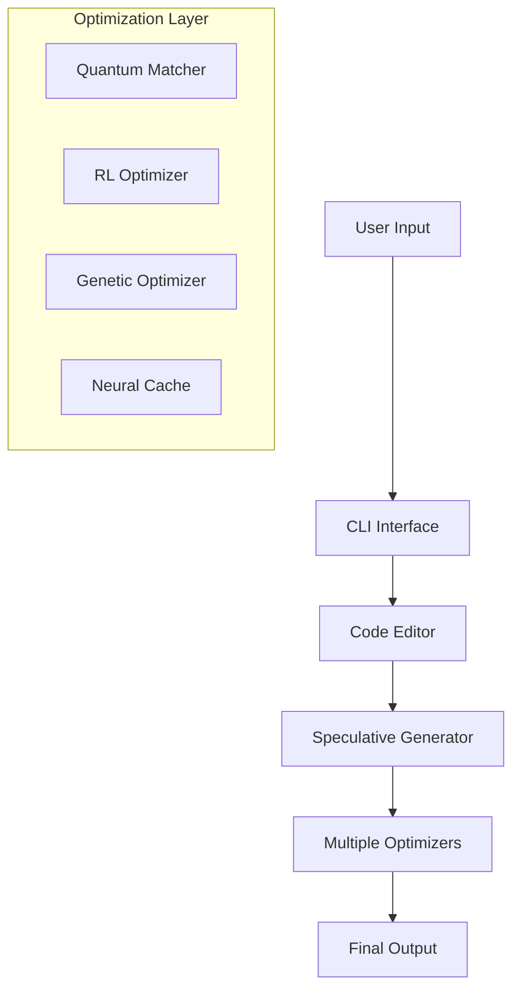
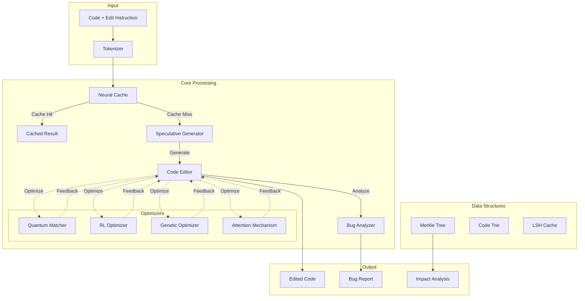
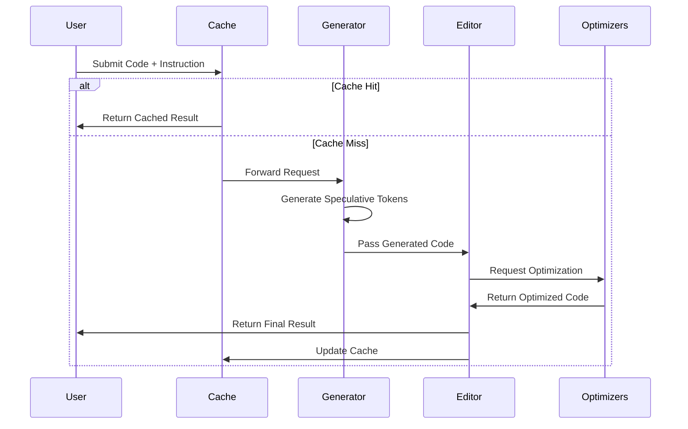
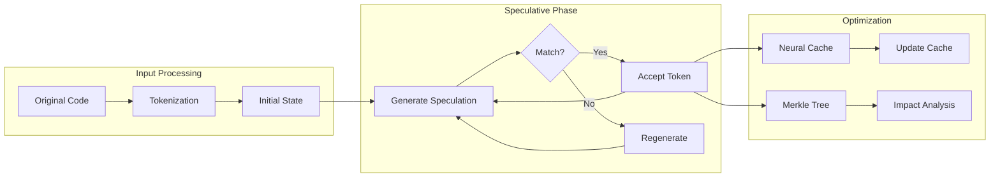

# AI-Powered Code Editor with Speculative Execution

## Overview
An advanced code editing system that uses AI to implement "speculative edits" using PyTorch and Hugging Face transformers. The system employs multiple optimization techniques including quantum-inspired pattern matching, neural caching, and Merkle trees for efficient code analysis and generation.

## Detailed System Operation

### 1. Core Architecture Flow


### 2. Step-by-Step Process

#### a) Input Processing
```python
# Via CLI or direct API
editor = CodeEditor(model, tokenizer, config)
result = editor.perfect_edit(code, instruction)
```
- User provides code and instruction
- System loads configuration and initializes components
- Input is tokenized and prepared for processing

#### b) Caching Layer
```python
# Neural cache check
embeddings = self._get_embeddings(code)
cached_result = self.neural_cache.query(embeddings)
if cached_result:
    return cached_result
```
- Checks if similar code/instruction has been processed before
- Uses neural embeddings for semantic similarity
- Returns cached result if found

#### c) Speculative Generation
```python
# In SpeculativeGenerator
def generate(self, prompt: str, max_tokens: int):
    # Generate initial tokens
    initial_tokens = self._parallel_speculate(output_ids)
    # Verify and accept/reject speculations
    for token in initial_tokens:
        if self._verify_token(token):
            output_ids.append(token)
```
- Generates multiple possible token sequences
- Uses parallel speculation for efficiency
- Verifies each speculation against model predictions

#### d) Optimization Layer

**1. Quantum Matching**
```python
# Pattern matching using quantum-inspired algorithm
patterns = self.quantum_matcher.prepare_superposition(patterns)
matches = self.quantum_matcher.measure(
    self.quantum_matcher.apply_grover(instruction, iterations=3)
)
```
- Uses quantum-inspired algorithms for pattern matching
- Faster search through pattern space

**2. Reinforcement Learning**
```python
# Optimize edit sequence
optimized_operations = self.edit_optimizer.optimize_edit(operations)
```
- Learns optimal edit sequences
- Improves based on past successes

**3. Genetic Algorithm**
```python
# Further optimize code
final_code = self.genetic_optimizer.optimize(
    edited_code,
    fitness_func=lambda x: self._calculate_edit_quality(x, instruction)
)
```
- Evolves multiple code versions
- Selects best performing variants

#### e) Merkle Tree Analysis
```python
# Track and analyze code changes
old_tree = self.merkle_analyzer.build_merkle_tree(code)
new_tree = self.merkle_analyzer.build_merkle_tree(edited_code)
impact_scores = self.merkle_analyzer.predict_impact(new_tree, old_tree)
```
- Efficiently tracks code changes
- Analyzes impact of modifications
- Maintains history for future reference

#### f) Performance Monitoring
```python
# Collect metrics
metrics = self.metrics_collector.collect_metrics()
self.logger.info(f"Performance metrics: {metrics}")
```
- Tracks performance metrics
- Monitors resource usage
- Logs important events

### 3. Key Features

#### Smart Caching
- Neural cache for semantic similarity
- LSH for fast lookups
- Merkle trees for structural comparison

#### Multiple Optimization Layers
- Quantum-inspired algorithms
- Reinforcement learning
- Genetic algorithms
- Neural attention mechanisms

#### Robust Error Handling
- Fallback mechanisms
- Multiple verification steps
- Impact analysis

### 4. Complete Usage Example
```python
# 1. Initialize with configuration
config = EditorConfig(
    model_name="gpt-2",
    max_tokens=1000,
    use_gpu=True
)
editor = CodeEditor(model, tokenizer, config)

# 2. Process edit
edited_code, operations, impact = editor.perfect_edit(
    code="def example(): pass",
    instruction="Add error handling"
)

# 3. Analyze results
bug_report = editor.analyze_bugs(edited_code)
metrics = editor.get_performance_metrics()
```

### 5. System Components
The system combines multiple advanced techniques to:
1. Speed up code generation through speculative execution
2. Improve edit quality using multiple optimization layers
3. Detect potential issues using advanced bug detection
4. Optimize resource usage with smart caching
5. Maintain code quality through impact analysis

## System Architecture


## Processing Flow


## Features
- **Speculative Code Generation**: Fast token generation using speculative execution
- **Intelligent Code Editing**: Context-aware code modifications with multiple optimization layers
- **Advanced Bug Detection**: Multi-level bug analysis using quantum-inspired algorithms
- **Semantic Analysis**: Deep code understanding using Merkle trees and attention mechanisms
- **Performance Optimizations**:
  - Neural caching for faster lookups
  - Locality-sensitive hashing
  - Probabilistic skip-lists
  - Hierarchical attention mechanisms

## Project Structure
```
code_editor/
├── core/
│   ├── speculative_generator.py    # Main generation engine
│   ├── code_editor.py             # Code editing functionality
│   ├── bug_analyzer.py            # Bug detection and analysis
│   └── semantic_analyzer.py        # Semantic code analysis
├── optimizers/
│   ├── quantum_matcher.py         # Quantum-inspired pattern matching
│   ├── neural_cache.py            # Neural network-based caching
│   ├── reinforcement_optimizer.py # RL-based optimization
│   ├── genetic_optimizer.py       # Genetic algorithm optimization
│   └── attention_mechanism.py     # Attention mechanisms
├── data_structures/
│   ├── merkle_tree.py            # Merkle tree implementation
│   └── code_trie.py              # Trie for code completion
├── utils/
│   ├── code_tokenizer.py         # Code tokenization utilities
│   ├── visualization.py          # Visualization tools
│   └── model_loader.py           # Model loading utilities
└── tests/
    ├── test_integration.py       # Integration tests
    ├── test_editor.py           # Editor unit tests
    └── test_optimizers.py       # Optimizer unit tests
```

## Installation
```bash
pip install -r requirements.txt
```

## Quick Start
```python
from code_editor.core.code_editor import CodeEditor
from code_editor.utils.model_loader import load_model

# Initialize the editor
model, tokenizer = load_model()
editor = CodeEditor(model, tokenizer)

# Example usage
code = """
def example():
    pass
"""
instruction = "Add error handling"
edited_code, operations, impact_scores = editor.perfect_edit(code, instruction)
```

## Advanced Features

### Quantum-Inspired Pattern Matching
```python
from code_editor.optimizers.quantum_matcher import QuantumPatternMatcher

matcher = QuantumPatternMatcher()
matches = matcher.find_patterns(code)
```

### Neural Caching
```python
from code_editor.optimizers.neural_cache import NeuralCache

cache = NeuralCache()
result = cache.query(code_embedding)
```

### Semantic Analysis
```python
from code_editor.core.semantic_analyzer import SemanticAnalyzer

analyzer = SemanticAnalyzer(model, tokenizer)
analysis = analyzer.analyze_semantics(code)
```

## Performance
The system uses multiple optimization techniques to achieve better performance:
- Speculative execution for faster generation
- Neural caching for quick lookups
- Merkle trees for efficient code comparison
- Quantum-inspired algorithms for pattern matching
- Hierarchical attention for focused analysis

## Requirements
- Python >= 3.8
- PyTorch >= 2.0.0
- Transformers >= 4.30.0
- Additional requirements in requirements.txt

## Development
```bash
# Run tests
python -m pytest tests/

# Run specific test
python -m pytest tests/test_integration.py
```

## System Architecture
### High-Level Architecture


### Speculative Execution Process



